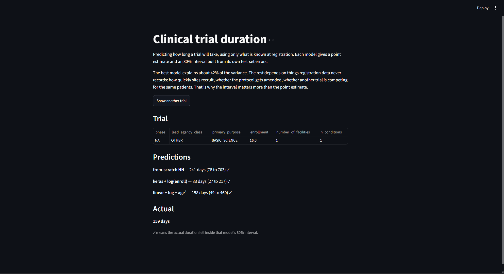
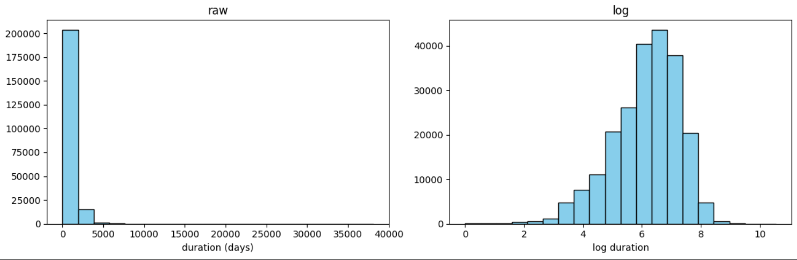
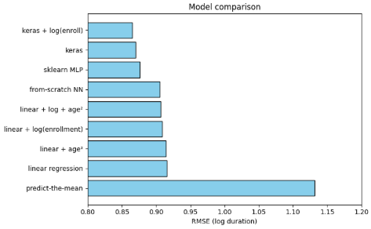
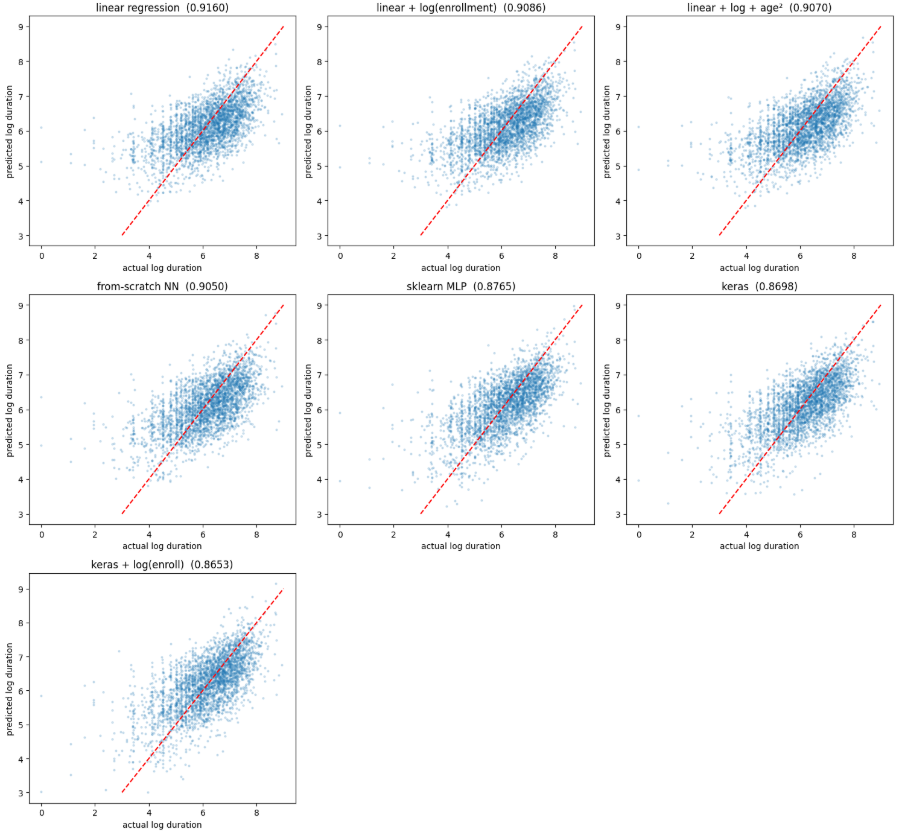
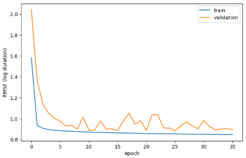
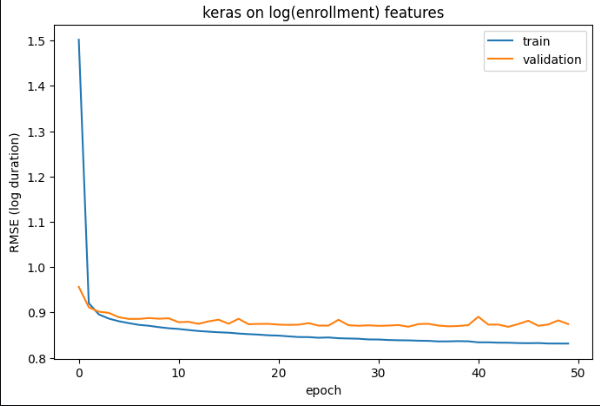

# Predicting How Long a Clinical Trial Will Take

**[Live demo](https://clinical-trial-duration-abdullah-ismail.streamlit.app/)** · [Data notebook](notebooks/Medical_trial_Project.ipynb) · [Neural network notebook](notebooks/NN_from_Scratch_Project.ipynb)



---

## Overview

Clinical trials take time, and nobody knows in advance how much. A study
planned for two years can run four.

This project asks: **using only what a sponsor records on the day a trial is
registered, how long will that trial take?**

### Why it matters

A trial that runs long delays the treatment reaching the people who need it.

Financially, underestimating duration means a sponsor has to find more money
partway through. Overestimating means capital sits reserved that could have
funded a different drug. A patent clock runs the whole time, so a slow trial
shortens the window in which the drug can be sold exclusively.

---

## Goals

1. Use only information available at registration. Anything recorded later
   would leak the answer.
2. Find out how much of trial duration is predictable at all.
3. Build a neural network from scratch in NumPy and verify it numerically.
4. Report a range, not a single number.

---

## Data

**AACT** (Aggregate Analysis of ClinicalTrials.gov), maintained by the Clinical
Trials Transformation Initiative, an FDA and Duke University partnership. Every
trial registered in the United States, across more than 40 linked tables.

Seven tables, filtered to interventional trials that have completed, registered
after 2007. **220,088 trials.**

> *Aggregate Analysis of ClinicalTrials.gov (AACT) Database, Clinical Trials
> Transformation Initiative (CTTI). https://aact.ctti-clinicaltrials.org/*

---

## Method

### Getting the data out

Four tables have one row per trial and join directly. Three have many rows per
trial, since a study can have several conditions, interventions, and
collaborating sponsors. Joining those directly would duplicate the trial: a
study of five conditions would appear five times. Each was collapsed to one row
per trial first.

### What counts as fair information

Somebody asking "how long will my trial take" has not run it yet, so any field
filled in later is off limits. AACT marks registration-time information
separately from post-completion results, which made the audit mostly
mechanical.

One partial exception, disclosed rather than hidden: enrollment is recorded as
a target at registration but overwritten with the final count at completion,
and the original is not recoverable. It is kept, since most of what it carries
is intended trial size, but it is not strictly a day-one value.

### Cleaning

The rule throughout: **fill in a missing value only when the value exists but
was not written down. When a blank means the thing does not exist, use a marker
plus a flag.**

| Situation | Decision |
|---|---|
| No minimum age listed | Fill with 0. The trial is open from birth, so that is the true value. |
| No maximum age listed | No upper limit exists. Filling in the oldest age seen would invent a ceiling, so it gets a placeholder plus a "has a maximum" flag. |
| 54% of trials have no phase | Not missing. Device, behavioural and surgical studies do not use the phase system. |
| 5% report zero trial sites | Impossible for a completed trial. Flagged rather than deleted, since poor record-keeping may itself predict a slow trial. |
| Design fields missing (under 2%) | Rows dropped. Filling in the most common value would invent a decision the investigators never made. |

### Measuring duration

Most trials cluster at the short end while a few stretch out for years.



Left is raw duration in days, right is the same data after taking the
logarithm. Everything here is measured on the right-hand scale and translated
back into days when reported.

### Models

Eight, each isolating one change: a baseline that predicts the average, linear
regression, three linear variants with hand-engineered features, two library
neural networks, and **a neural network written from scratch in NumPy**.

The from-scratch network has two hidden layers with every derivative worked out
by hand, no automatic differentiation. Correctness was checked by nudging
individual weights, measuring how the error actually changed, and comparing
that against the hand-derived formulas. **They agreed to nine decimal places on
all three layers.**

### Ranges

Each model reports an **80% range**, built from how wrong that model was on
trials it had never seen.

---

## Results

| Model | R² |
|---|---|
| Always predict the average | 0.000 |
| Linear regression | 0.345 |
| Linear + age² | 0.348 |
| Linear + log(enrollment) | 0.355 |
| Linear + log + age² | 0.358 |
| **Neural network, from scratch** | **0.361** |
| scikit-learn neural network | 0.400 |
| Keras neural network | 0.409 |
| **Keras + log(enrollment)** | **0.415** |



The best model explains about **42% of the variation**, a 23.5% improvement in
error over the baseline.

### All models land within seven percentage points



Each panel plots what a model predicted against what happened. A perfect model
would put every point on the diagonal. All seven clouds look nearly identical,
which is why a single number is not the right output here.

### One rescaling helped every model

Enrollment ranges from a handful of people to a recorded twenty million. That
largest value is a *date* typed into a numeric field. Compressing the range
improved every model, and fixed a training problem.

Raw enrollment:



The error swings by roughly a factor of two between rounds, so the final result
depends on where training happened to stop.

After rescaling:



Same architecture, same data, one column rescaled.

### 58% of the variation is not predictable from registration data

The features carry independent information and are not redundant with one
another, so the missing signal is not a column left out of the query. It is
information that does not exist on day one: how quickly sites recruit patients,
whether the protocol gets amended, whether a competing trial is chasing the
same participants.

### The from-scratch network lands with the linear models

It beats plain linear regression, so it learned something a straight line
cannot represent, but it trails scikit-learn and Keras. The mathematics is
verified correct, so the gap is training strategy: 300 large steps here against
roughly 27,000 smaller ones in the libraries.

### What a range looks like

A prediction of 800 days comes with a range of roughly **260 to 2,300 days**.

Wide, and meant to be. For someone budgeting against a forecast, the range is
more useful than the midpoint.

### Limitations

- **Only completed trials are visible.** Terminated trials and trials still
  running past expectation have no end date. Estimates skew optimistic. The
  model answers "given that this trial finishes, how long will it take," not
  "will it finish."
- **Every trial gets the same range width.** A large, well-funded study gets
  the same span as a rare-disease study.

---

## Try it

The [live demo](https://clinical-trial-duration-abdullah-ismail.streamlit.app/) picks a trial the models never saw
during training, shows three predictions, and reveals the actual duration. A
tick shows whether the truth fell inside each model's range. Roughly eight in
ten should.

```bash
pip install -r requirements.txt
streamlit run app.py
```

---

## Next steps

**Add available but unused data.** Disease category is the most promising,
since a rare condition recruits far more slowly than a common one, and AACT
stores standardised disease terms in a table not queried here. Country
breakdown is second: approval times differ by jurisdiction, and a trial
spanning fifteen countries faces fifteen approval processes.

**Vary the range width by trial.** Methods exist that widen it for unusual
trials and narrow it for typical ones.

**Improve the from-scratch network's training.** Mini-batch updates by hand
would close most of the gap to the libraries.

**Model whether a trial completes at all.** Around 34,000 terminated trials sit
in AACT unused.

---

## Individual contributions

Solo project. Database extraction and SQL, cleaning decisions, exploratory
analysis, the from-scratch neural network and its derivation, benchmarking, the
Streamlit application, and this write-up are all my own.

**Abdullah Ismail**, Computer Science & Mathematics, Northeastern University
[GitHub](https://github.com/25abdullah) · [LinkedIn](https://linkedin.com/in/abdullah-ismail-09a964368)

---

## Repository

```
README.md              this file
app.py                 the Streamlit demo
demo_data.npz          predictions and ranges the demo reads
requirements.txt       dependencies
notebooks/
  Medical_trial_Project.ipynb    data extraction through model comparison
  NN_from_Scratch_Project.ipynb  the neural network, derived and verified
```

**Tools:** Python, SQL, pandas, NumPy, scikit-learn, Keras, Streamlit